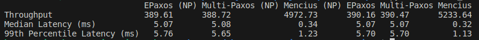

Implementation details
======

## Table 1 (4 EC2 instances, 1 for the master + a server, 2 for servers and 1 for the client)
### NP (No-pipelined with small commands)
#### Epaxos (epaxos_enabled=true), Multi-Paxos (epaxos_enabled=false) and Mencius (mencius_enabled=true)
- run_master **replicas** <br>
 ```bash
./run_master.sh 3
 ```
- run_servers **replicas** **gomaxprocs** **thrifty** **epaxos_enabled** **mencius_enabled** <br>
 ```bash
./run_server.sh 3 2 false true false
 ```
- run_client **replicas** **clients** **requests** **writes** **epaxos_enabled** **batch_size** **GOMAXPROCS** **conflicts** **filename** <br>
 ```bash
./run_client.sh 3 2 20000 50 true 1 2 0 np_epaxos
 ```

### (pipelined with small commands)
#### Epaxos (epaxos_enabled=true), Multi-Paxos (epaxos_enabled=false) and Mencius (mencius_enabled=true)
- run_master **replicas** <br>
 ```bash
./run_master.sh 3
 ```
- run_servers **replicas** **gomaxprocs** **thrifty** **epaxos_enabled** **mencius_enabled** <br>
 ```bash
./run_server.sh 3 4 false true false
 ```
- run_client **replicas** **clients** **requests** **writes** **epaxos_enabled** **batch_size** **GOMAXPROCS** **conflicts** **filename** <br>
 ```bash
./run_client.sh 3 2 20000 50 true 1 30 0 p_epaxos
 ```

Analyze the results in the `logs/` folder and create the table:
 ```bash
python3 create_table1.py
 ```

The table will look like this: <br>


## Figure 4 (Batching small commands)
### 4a & 4b (4 EC2 instances, 1 for the master + a server, 2 for servers and 1 for the client)
#### Clients=20,40,60,80,100,200,300,400,500
##### Epaxos (epaxos_enabled=true and c=0), Epaxos (epaxos_enabled=true and c=100) and Multi-Paxos (epaxos_enabled=false)
- run_master **replicas** <br>
 ```bash
./run_master.sh 3
 ```
- run_servers **replicas** **gomaxprocs** **thrifty** **epaxos_enabled** **mencius_enabled** <br>
 ```bash
./run_server.sh 3 4 false true false
 ```
- run_client **replicas** **clients** **requests** **writes** **epaxos_enabled** **batch_size** **GOMAXPROCS** **conflicts** **filename** <br>
 ```bash
./run_client.sh 3 20 20000 50 true 10 30 0 batching_epaxos0
 ```

### 4c represents the plot with 5 replicas and 99%ile Latency (ms) in y axis <br>
### 4d modified a bit (4 EC2 instances, 1 for the master + a server, 2 for servers and 1 for the client)
#### Clients=20,40,60,80,100,200,300,400,500
##### Epaxos (epaxos_enabled=true and c=0), Epaxos (epaxos_enabled=true and c=100) and Multi-Paxos (epaxos_enabled=false)
- run_master **replicas** <br>
 ```bash
./run_master.sh 5
 ```
- run_servers **replicas** **gomaxprocs** **thrifty** **epaxos_enabled** **mencius_enabled** <br>
 ```bash
./run_server.sh 5 4 false true false
 ```
- run_client **replicas** **clients** **requests** **writes** **epaxos_enabled** **batch_size** **GOMAXPROCS** **conflicts** **filename** <br>
 ```bash
./run_client.sh 5 20 20000 50 true 10 30 0 batching_epaxos0
 ```

## Figures from EPaxos (No-Batching small commands)
### 8 (4 EC2 instances, 1 for the master + a server, 2 for servers and 1 for the client)
#### Clients=20,40,60,80,100,200,300,400,500
##### Epaxos (epaxos_enabled=true and c=0), Epaxos (epaxos_enabled=true and c=25), Epaxos (epaxos_enabled=true and c=100), Mencius (mencius_enabled=true and c=0), Mencius (mencius_enabled=true and c=100) and Multi-Paxos (epaxos_enabled=false)
- run_master **replicas** <br>
 ```bash
./run_master.sh 3
 ```
- run_servers **replicas** **gomaxprocs** **thrifty** **epaxos_enabled** **mencius_enabled** <br>
 ```bash
./run_server.sh 3 4 true true false
 ```
- run_client **replicas** **clients** **requests** **writes** **epaxos_enabled** **batch_size** **GOMAXPROCS** **conflicts** **filename** <br>
 ```bash
./run_client.sh 3 20 20000 50 true 10 30 0 batching_epaxos0
 ```